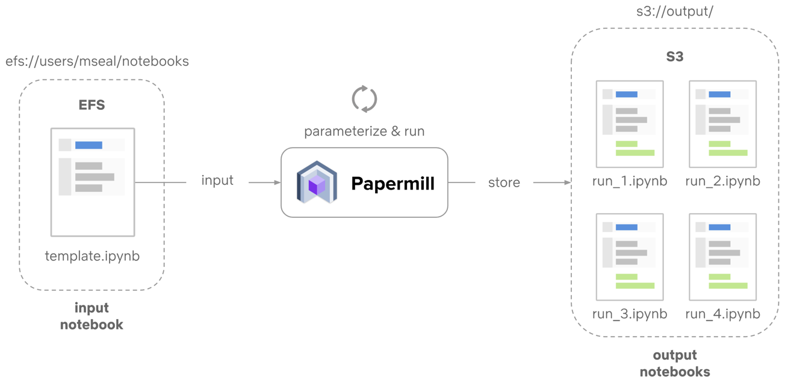
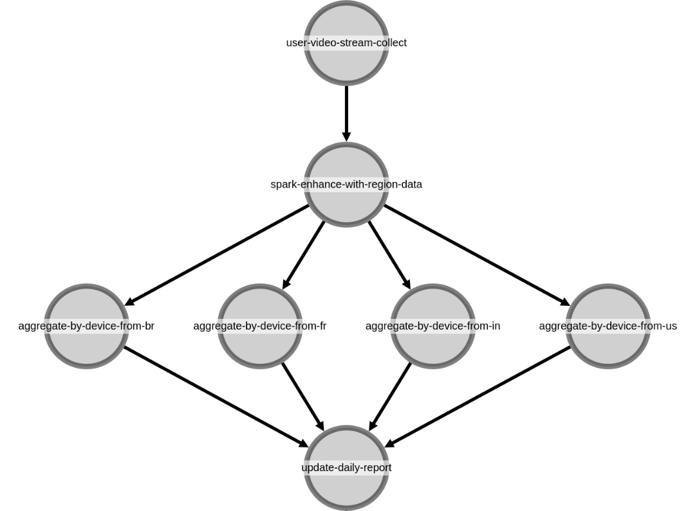
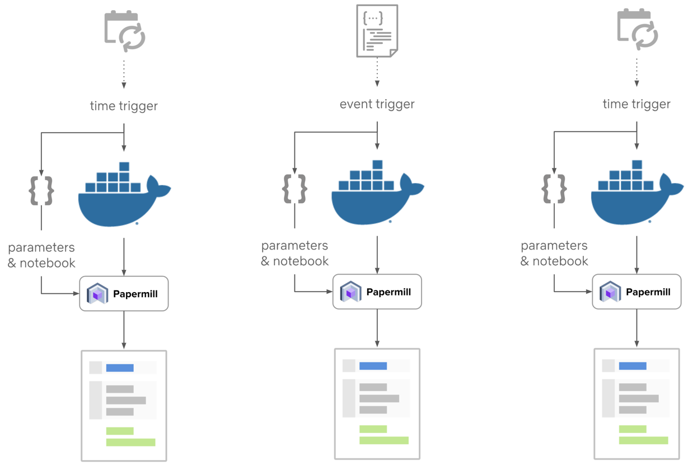
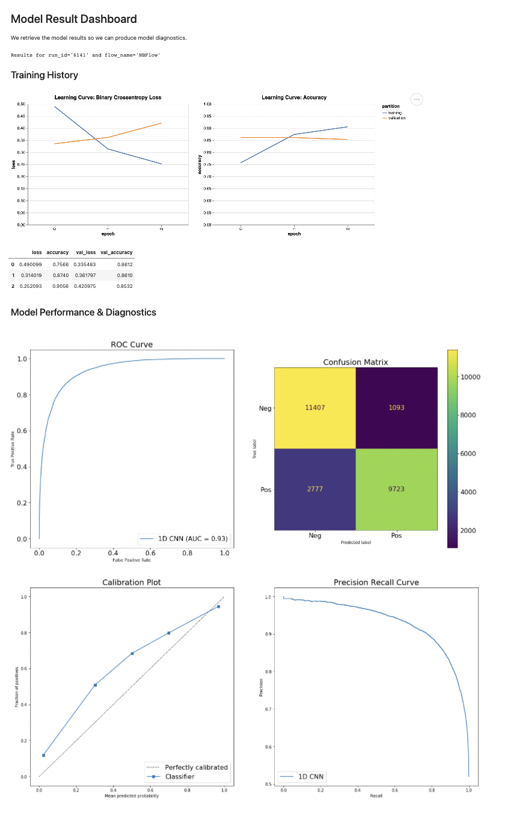
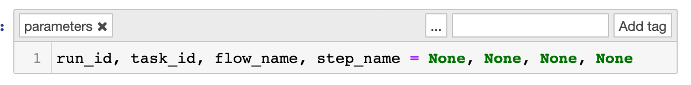

  [](./LICENSE) [](https://github.com/outerbounds/metaflow-card-notebook/actions/workflows/test.yaml)     [](https://pypi.org/project/metaflow-card-notebook/)  [](http://slack.outerbounds.co/)  
# metaflow-card-notebook

> Use `@card(type='notebook')` to programatically run & render notebooks in your Flows.

<!-- TOC -->

- [metaflow-card-notebook](#metaflow-card-notebook)
- [Installation](#installation)
- [Motivation](#motivation)
- [Usage](#usage)
    - [Step 1: Prepare your notebook](#step-1-prepare-your-notebook)
    - [Step 2: Prepare your flow with the notebook card](#step-2-prepare-your-flow-with-the-notebook-card)
    - [Step 3: Prototype the rest of your notebook](#step-3-prototype-the-rest-of-your-notebook)
    - [Step 4: Test the card](#step-4-test-the-card)
- [Customized Rendering](#customized-rendering)
- [Common Issues](#common-issues)
    - [Papermill Arguments](#papermill-arguments)
    - [Remote Execution](#remote-execution)
        - [Dependency Management](#dependency-management)
        - [Including Notebook Files In The Context](#including-notebook-files-in-the-context)
- [Examples](#examples)

<!-- /TOC -->

# Installation

```bash
pip install metaflow-card-notebook
```

# Motivation


You may have seen [this series of blog posts](https://netflixtechblog.com/notebook-innovation-591ee3221233) that have been written about Notebook Infrastructure at Netflix.  Of particular interest is how notebooks [are programatically run](https://netflixtechblog.com/scheduling-notebooks-348e6c14cfd6), often in DAGs, to generate reports and dashboards:

Parameterized Exeuction of Notebooks             |  Notebooks in DAGs | Dependency Management & Scheduling
:-------------------------:|:-------------------------:|:-------------------------:
  |  | 


This way of generating reports and dasbhoards is very compelling, as it lets data scientists create content using environments and tools that they are familiar with.  **With `@card(type='notebook')` you can programatically run and render notebooks as part of a DAG.** This card allows you to accomplish the following:

- Run notebook(s) programmatically in your Metaflow DAGs.
- Access data from any step in your DAG so you can visualize it or otherwise use it to generate reports in a notebook.
- Render your notebooks as reports or model cards that can be embedded in various apps.
- Inject custom parameters into your notebook for execution.
- Ensure that notebook outputs are reproducible.


Additionally, you can use all of the features of Metaflow to manage the execution of notebooks, for example:
- Managing dependencies (ex: `@conda`)
- Requesting compute (ex: `@resources`)
- Parallel execution (ex: `foreach`)
- etc.

Here is an example of a dashboard generated by a notebook card:


>  _you can see real examples of Flows that generate these dashboards in [examples](examples/)_


# Usage

## Step 1: Prepare your notebook

The notebook card injects the following five variables into your notebook:

1. `run_id`
2. `step name`
3. `task_id`
4. `flow_name`
5. `pathspec`

You can use these variables to retrieve the data you need from a Flow.  It is recommended that the first cell in your notebook defines these variables, and that [you designate this cell with the tag "parameters"](https://papermill.readthedocs.io/en/latest/usage-parameterize.html).

For example of this, see [tests/nbflow.ipynb](tests/nbflow.ipynb):





> Note: in the example notebook thse variables are set to `None` however, you can set these variables to real values based on flows that have been previously executed for prototyping.


## Step 2: Prepare your flow with the notebook card

You can render cards from notebooks using the `@card(type='notebook')` decorator on a step.  For example, in [tests/nbflow.py](tests/nbflow.py), the notebook [tests/nbflow.ipynb](tests/nbflow.ipynb) is run and rendered programatically:

```python
from metaflow import step, current, FlowSpec, Parameter, card

class NBFlow(FlowSpec):

    exclude_nb_input = Parameter('exclude_nb_input', default=True, type=bool)

    @step
    def start(self):
        self.data_for_notebook = "I Will Print Myself From A Notebook"
        self.next(self.end)
    
    @card(type='notebook')
    @step
    def end(self):
        self.nb_options_dict = dict(input_path='nbflow.ipynb', exclude_input=self.exclude_nb_input)

if __name__ == '__main__':
    NBFlow()
```
Note how the `start` step stores some data that we want to access from a notebook later.  We will discuss how to access this data from a notebook in the next step.

By default, a step that is decorated with `@card(type='notebook')` expects the variable `nb_options_dict` to be defined in the step.  This variable is a dictionary of arguments that is passed to [papermill.exeucte.notebook](https://papermill.readthedocs.io/en/latest/reference/papermill-workflow.html#module-papermill.execute).  Only the `input_path` argument is required.  If `output_path` is absent, this is automatically set to  `_rendered_<run_id>_<step_name>_<task_id>_<your_input_notebook_name>.ipynb`.

Furthermore, the `exclude_input` is an additional boolean argument that specifies whether or not to show our hide cell outputs, which is `False` by default.  


## Step 3: Prototype the rest of your notebook

Recall that the `run_id`, `step_name`, `task_id`, `flow_name` and `pathspec` are injected into the notebook.  We can access this in a notebook using [Metaflow's utlities for inspecting Flows and Results](https://docs.metaflow.org/metaflow/client).  We demonstrate this in [tests/nbflow.ipynb](tests/nbflow.ipynb):


Some notes about this notebook:

- We recommend printing the variables injected into the notebook.  This can help with debugging and provide an easy to locate lineage.
- We demonstrate how to access your Flow's data via a `Step` or a `Task` object.  You can read more about the relationship between these objects [in these docs](https://docs.metaflow.org/metaflow/client). In short, a `Task` is a children of a `Step` because a `Step` can have many tasks (for example if you use a `foreach` construct for parallelism).
- We recommend exeucting a run manually and prototyping the notebook by temporarily supplying the `run_id`, `flow_name`, etc to achieve the desired result.

## Step 4: Test the card

To test the card in the example outlined above, you must first run the flow (the parenthesis allows the commands to run in a subshell):

```bash
(cd tests && python nbflow.py run)
```

Then, render the card

```bash
(cd tests && python nbflow.py card view end)
```

By default, the cell inputs are hidden when the card is rendered.  For learning purposes it can be useful to render the card with the inputs to validate how card is executed.  You can do this by setting the `exclude_nb_input` parameter to `False` that was defined in the flow:

```bash
(cd tests && python nbflow.py run --exclude_nb_input=False && python nbflow.py card view end)
```

# Customized Rendering

The `@card(type='notebook')` is an opinionated way to execute and render notebooks with the tradeoff of requiring significantly less code.  While some customization is possible by passing the appropriate arguments to `nb_options_dict` as listed in [papermill.exeucte.notebook](https://papermill.readthedocs.io/en/latest/reference/papermill-workflow.html#module-papermill.execute), you can achieve more fine-grained control by exeucting and rendering the notebook yourself and using the [html card](https://github.com/outerbounds/metaflow-card-html).  We show an example of this in [examples/deep_learning/dl_flow.py](examples/deep_learning/dl_flow.py):

```py
    @card(type='html')
    @step
    def nb_manual(self):
        """
        Run & Render Jupyter Notebook Manually With The HTML Card.
        
        Using the html card provides you greater control over notebook execution and rendering.
        """
        import papermill as pm
        output_nb_path = 'notebooks/rendered_Evaluate.ipynb'
        output_html_path = output_nb_path.replace('.ipynb', '.html')

        pm.execute_notebook('notebooks/Evaluate.ipynb',
                            output_nb_path,
                            parameters=dict(run_id=current.run_id,
                                             flow_name=current.flow_name,)
                             )
        run(f'jupyter nbconvert --to html --no-input --no-prompt {output_nb_path}')
        with open(output_html_path, 'r') as f:
            self.html = f.read()
        self.next(self.end)
```

You can the following command in your terminal the see output of this step(may take several minutes):

```bash
(cd example && python dl_flow.py  run && python dl_flow.py card view nb_manual) 
```

# Common Issues

## Papermill Arguments

Many issues can be resolved by providing the right arguments to [papermill.exeucte.notebook](https://papermill.readthedocs.io/en/latest/reference/papermill-workflow.html#module-papermill.execute).  Below are some common issues and examples of how to resolve them:

1. **Kernel Name**: The name of the python kernel you use locally may be different from your remote execution environment.  By default, papermill will attempt to find a kernel name in the metadata of your notebook, which is often automatically created when you select a kernel while running a notebook.  You can use the `kernel_name` arugment to specify a kernel.  Below is an example:

```python
    @card(type='notebook')
    @step
    def end(self):
        self.nb_options_dict = dict(input_path='nbflow.ipynb', kernel_name='Python3')
```

2. **Working Directory**: The working directory may be important when your notebook is executed, especially if your notebooks relies on certain files or other assets.  You can set the working directory the notebook is executed in with the `cwd` argument, for example to set the working directory to `data/`:

```python
    @card(type='notebook')
    @step
    def end(self):
        self.nb_options_dict = dict(input_path='nbflow.ipynb', cwd='data/')
```

## Remote Execution

### Dependency Management

If you are running your flow remotely, for example [with `@batch`](https://docs.metaflow.org/metaflow/scaling#using-aws-batch-selectively-with-batch-decorator), you must remember to include the depdendencies for this notebook card itself!  One way to do this is using `pip` as illustrated below:

```python
    @card(type='notebook')
    @step
    def end(self):
        import os, sys
        os.system(f"{sys.executable} -m pip install metaflow-card-notebook")
        self.nb_options_dict = dict(input_path='nbflow.ipynb')
```

Note: You can omit the `pip install` step above if your environment already includes all the dependendencies in your target environment listed in [setup.py](/setup.py) in `install_requires`.  If you do omit `pip install`, make sure that you pin the correction version numbers as well.

### Including Notebook Files In The Context

If you are running steps remotely, you must ensure that your notebooks are uploaded to the remote environment with the cli argument `--package-suffixes=".ipynb"` For example, to execute [examples/deep_learning/dl_flow.py](examples/deep_learning/dl_flow.py) with this argument:

```bash
(cd example && python dl_flow.py  --package-suffixes=".ipynb" run)
```

# Examples

We provide several examples of flows that contain the notebook card in [examples/](examples/).
